# DVWA Security Lab Report

**Author:** Meesum Abbas  
**Target Application:** Damn Vulnerable Web Application (DVWA)  

## Environment Setup Description
Pulled `vulnerables/web-dvwa` from docker for `linux/amd-64` platform. Used the command `docker run -d --name dvwa --platform linux/amd64 -p 8080:80 vulnerables/web-dvwa` to create a container with the name `dvwa` and run it for amd64 platform (since working on ARM-architecture Mac).

---

## Executive Summary
This report documents the security testing and vulnerability assessment performed on the DVWA platform. The objective of this assessment is to identify, exploit, and document common web application vulnerabilities.

---


## 1. BruteForce 
* **Vulnerability Type:** Improper Authentication / Lack of Rate Limiting
* **OWASP Category:** A07:2021-Identification and Authentication Failures

### Security Level: Low
#### Attack: 
1. Signed in with the admin password username. 
2. Opened the link of the image and modified the url to get the list of all users. 
3. Used SQL injection to login.

4. Also used cluster bomb attack with the 100 most common passwords to find the passwords for all users. Used Burp Suite Intruder with the payload 
```
GET /vulnerabilities/brute/?username=$username$&password=$password$&Login=Login HTTP/1.1
Host: localhost:8071
User-Agent: Mozilla/5.0 (Macintosh; Intel Mac OS X 10.15; rv:148.0) Gecko/20100101 Firefox/148.0
Accept: text/html,application/xhtml+xml,application/xml;q=0.9,*/*;q=0.8
Accept-Language: en-GB,en;q=0.9
Accept-Encoding: gzip, deflate, br
Connection: keep-alive
Referer: http://localhost:8071/vulnerabilities/brute/
Cookie: PHPSESSID=05qs47qrd3pvvs2gm0cr1he6b1; security=low
Upgrade-Insecure-Requests: 1
Sec-Fetch-Dest: document
Sec-Fetch-Mode: navigate
Sec-Fetch-Site: same-origin
Sec-Fetch-User: ?1
Priority: u=0, i
```
5. Used String Matching to verify which passwords were accepted

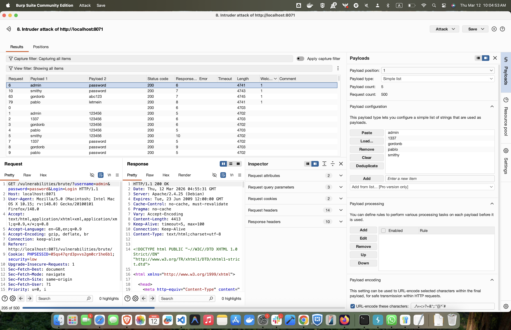 
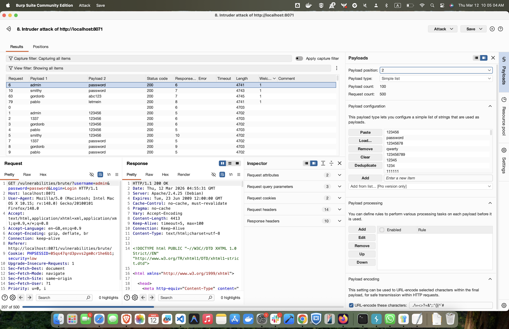
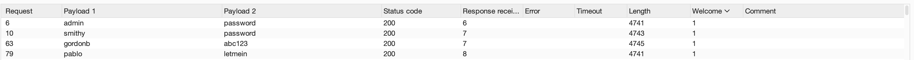

#### Analysis:
- **Why it passed:** No effective brute-force protections (no lockout, no throttling, no CAPTCHA), and weak credential handling allowed automated guessing.
- **How higher levels mitigate:** Adding input hardening, request controls, and tokenized workflows increases effort and reduces direct automation.

---

### Security Level: Medium
#### Attack: 
1. This time sql injection failed.
2. However the same payload (after updating security to medium in cookies) worked in Burp Suite for finding. Payload:
```
GET /vulnerabilities/brute/?username=$username$&password=$password$&Login=Login HTTP/1.1
Host: localhost:8071
User-Agent: Mozilla/5.0 (Macintosh; Intel Mac OS X 10.15; rv:148.0) Gecko/20100101 Firefox/148.0
Accept: text/html,application/xhtml+xml,application/xml;q=0.9,*/*;q=0.8
Accept-Language: en-GB,en;q=0.9
Accept-Encoding: gzip, deflate, br
Connection: keep-alive
Referer: http://localhost:8071/vulnerabilities/brute/
Cookie: PHPSESSID=05qs47qrd3pvvs2gm0cr1he6b1; security=medium
Upgrade-Insecure-Requests: 1
Sec-Fetch-Dest: document
Sec-Fetch-Mode: navigate
Sec-Fetch-Site: same-origin
Sec-Fetch-User: ?1
Priority: u=0, i
```

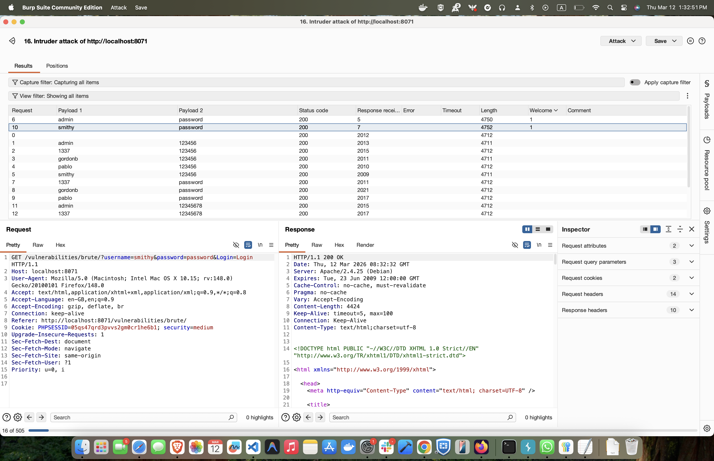

#### Analysis:
- **Why it passed:** SQL injection was reduced, but password guessing still worked because rate-limiting and account lock protections were still insufficient.
- **How higher levels mitigate:** Per-request tokens and stricter anti-automation controls make repeated forged attempts harder to scale.

---
### Security Level: High
#### Attack: 
1. This time the default brutefroce failed. The paylooad now expects a user_token, generated each time the user visits the login page and is a one time token. Payload
```
GET /vulnerabilities/brute/?username=$username$&password=$password$&Login=Login HTTP/1.1
Host: localhost:8071
User-Agent: Mozilla/5.0 (Macintosh; Intel Mac OS X 10.15; rv:148.0) Gecko/20100101 Firefox/148.0
Accept: text/html,application/xhtml+xml,application/xml;q=0.9,*/*;q=0.8
Accept-Language: en-GB,en;q=0.9
Accept-Encoding: gzip, deflate, br
Connection: keep-alive
Referer: http://localhost:8071/vulnerabilities/brute/
Cookie: PHPSESSID=05qs47qrd3pvvs2gm0cr1he6b1; security=high
Upgrade-Insecure-Requests: 1
Sec-Fetch-Dest: document
Sec-Fetch-Mode: navigate
Sec-Fetch-Site: same-origin
Sec-Fetch-User: ?1
Priority: u=0, i
```
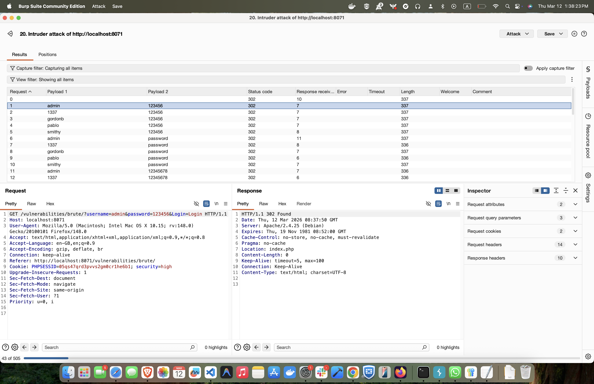
2. However using macros, that fetch the user token from the html each time, we can send the requests.
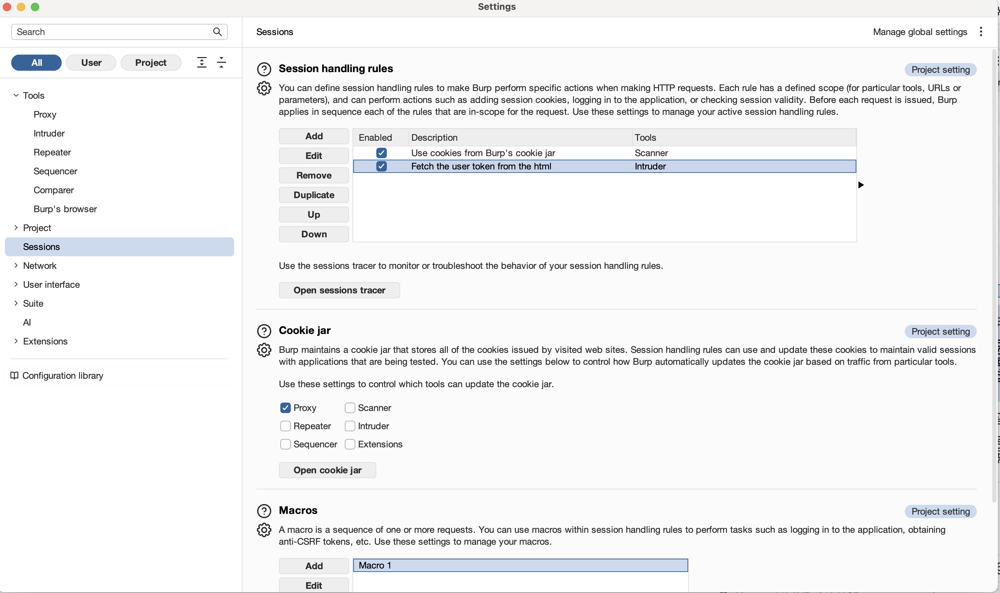

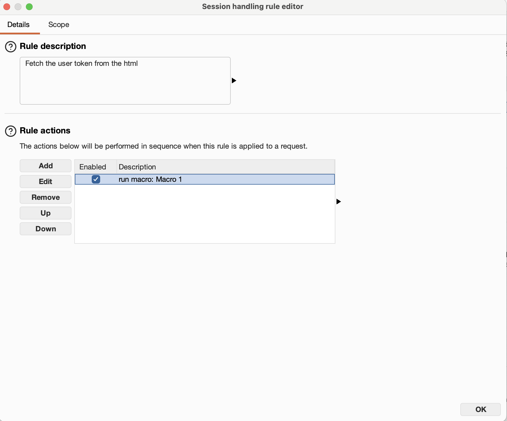

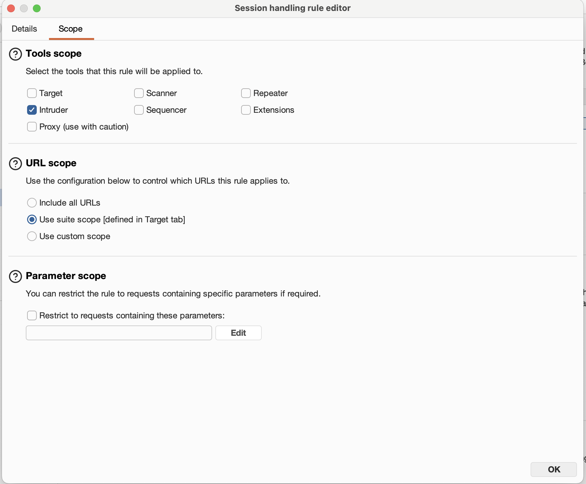

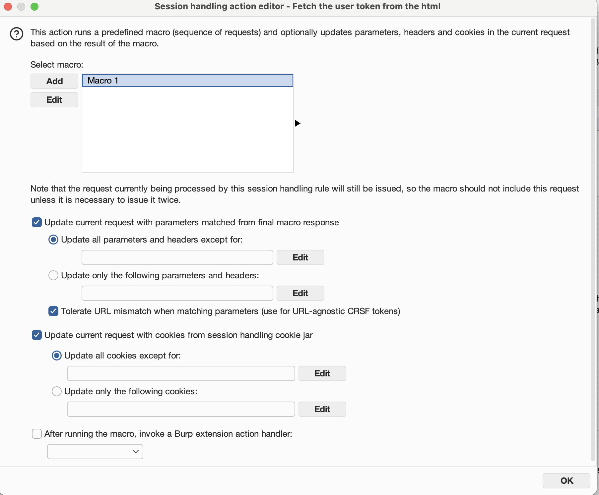


The final Payload: 
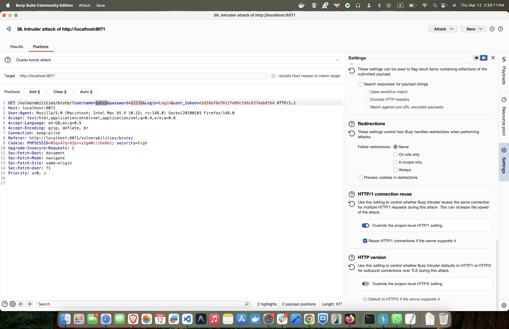 
Success Evidence: 
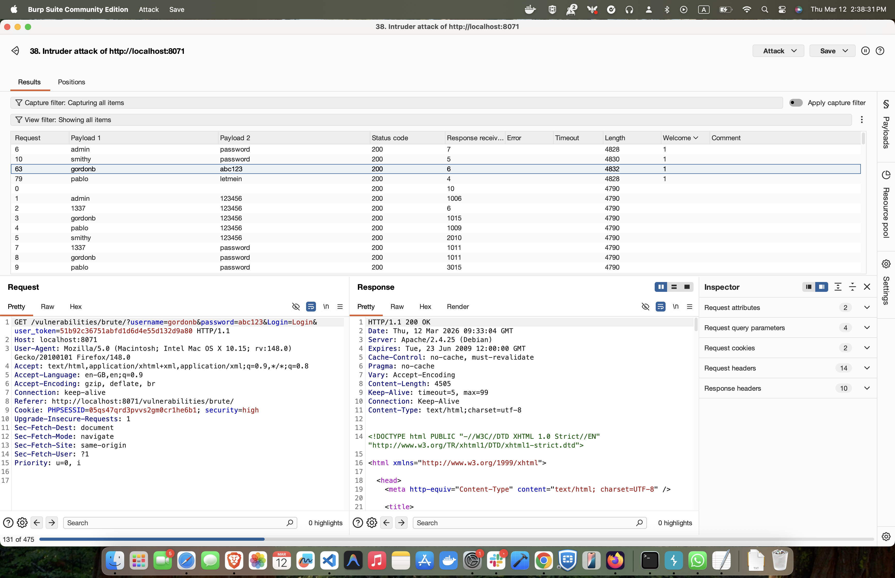

#### Analysis:
- **Why it passed:** Security relied on a token, but Burp macros automated token retrieval and replay, bypassing the intended one-time barrier.
- **How higher levels mitigate:** Binding tokens to strict request context, adding behavioral rate checks, and MFA/CAPTCHA further reduce brute-force success.

---

### Note:
I have used Burp Suite for convenience and faster results, though most of this can be achieved by looping over the lists with a curl call. Also, I didn't want to have AI generate the script for me without me actually learning a lot so used this route.


## 2. Command Injection
* **Vulnerability Type:** Command Injection
* **OWASP Category:** A03:2021-Injection

### Security Level: Low
#### Attack:
1. The application takes an IP address and executes a `ping` command.
2. By appending a semicolon `;` or an ampersand `&`, we can execute arbitrary shell commands.
3. Input used: `127.0.0.1 | ls`
4. This allowed us to list the files in the current working directory.

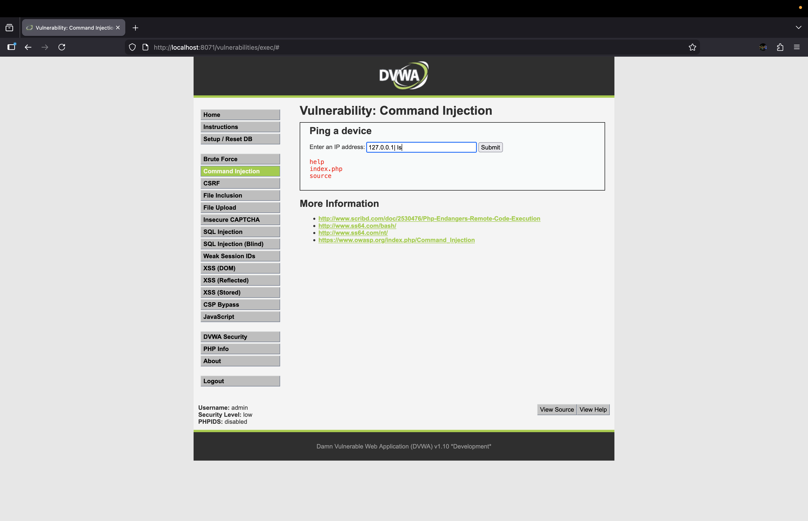

#### Analysis:
- **Why it passed:** User input reached shell execution directly with no strong sanitization or allowlist validation.
- **How higher levels mitigate:** Character filtering and stricter command controls reduce direct command chaining opportunities.

---

### Security Level: Medium
#### Attack:
1. In this level, some special characters like `&&` and `;` are blacklisted by the application's source code.
2. However, other operators like `|` (pipe) or `&` (background) are still allowed or the blacklist might be incomplete.
3. By inspecting the source code, we can identify which characters are filtered and find alternatives.
4. Input used: `127.0.0.1 | ls`

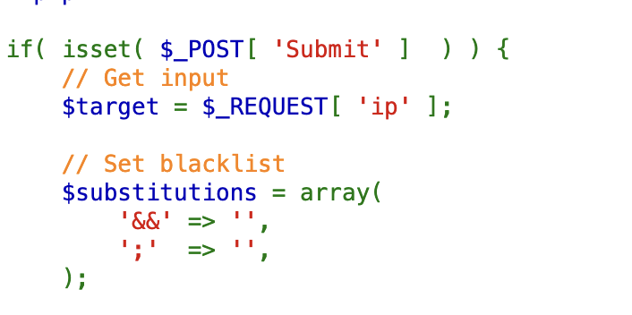
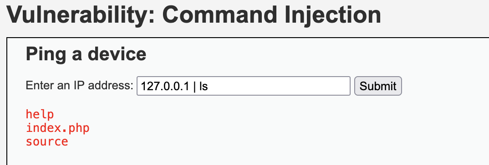

#### Analysis:
- **Why it passed:** Blacklist filtering was incomplete, so alternative operators still bypassed restrictions.
- **How higher levels mitigate:** More restrictive filtering can block more payloads, but robust allowlisting and avoiding shell calls are stronger fixes.

---

### Security Level: High
#### Attack:
1. The blacklist is more extensive in this level, attempting to filter out most command separators.
2. A common mistake in blacklisting is including spaces or not accounting for all variations of an operator.
3. In this case, the blacklist for `| ` (pipe followed by a space) was used instead of just `|`.
4. By using the operator without a space or using a different bypass, we can still execute commands.
5. Input used: `127.0.0.1 |ls`

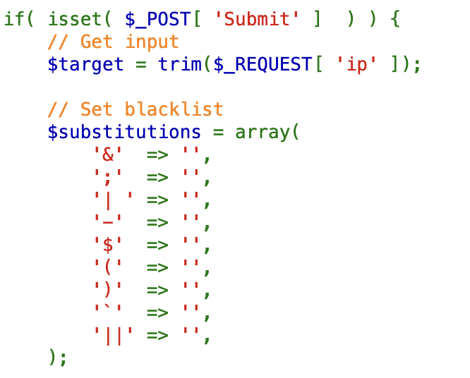
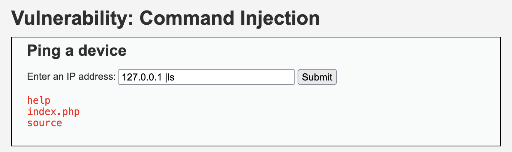

#### Analysis:
- **Why it passed:** Defensive logic still depended on blacklist patterns, and small parsing gaps (like spacing assumptions) enabled bypass.
- **How higher levels mitigate:** Replacing shell execution with safe APIs and strict allowlisted inputs would remove this class of bypass.

### Note:
We can use tools liuke BURP Suite or a simple python script, that bruteforces through all the possible characters and some combinations and check the result, which will allow us to find the vulnerability when the source code is protected.

---

## 3. Cross-Site Request Forgery (CSRF)
* **Vulnerability Type:** Cross-Site Request Forgery (CSRF)
* **OWASP Category:** A01:2021-Broken Access Control

### Security Level: Low
#### Attack:
1. The application allows changing the user's password via a simple GET request without any CSRF tokens.
2. An attacker can craft a malicious URL and trick a logged-in user into clicking it.
3. Example payload and request:
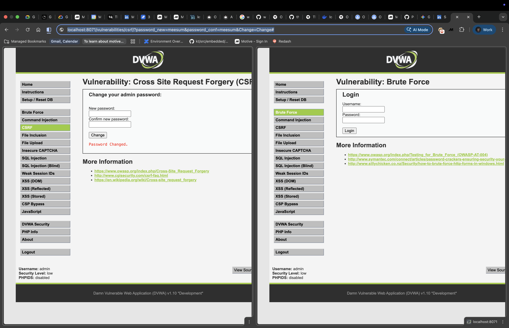
4. The password is successfully changed without the user's explicit consent: 
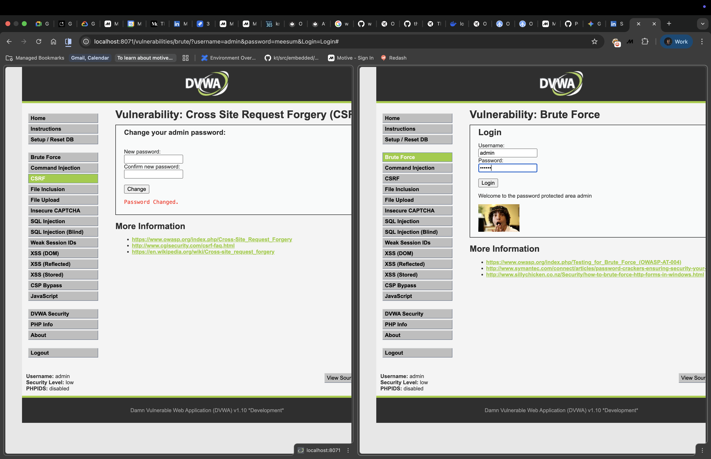

#### Analysis:
- **Why it passed:** No CSRF token or origin validation was enforced, so a crafted URL could trigger state-changing actions.
- **How higher levels mitigate:** Referer/origin checks and token validation add request legitimacy checks before accepting password changes.

---

### Security Level: Medium
#### Attack:
1. The application introduces a check on the `HTTP Referer` header to ensure the request originates from the same server.
2. We begin with a legitimate request to observe the standard behavior and how security is enforced.

3. Using Burp Suite, we use the same referer token with a password change request to modify it.
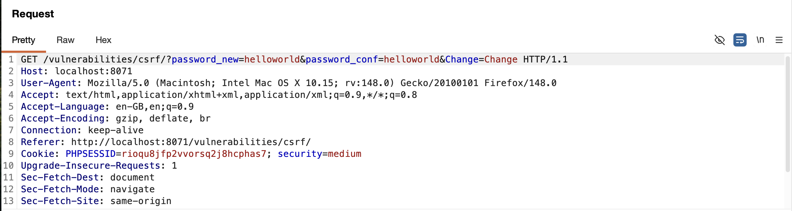
4. We verify that the password has been successfully changed through the intercepted request.
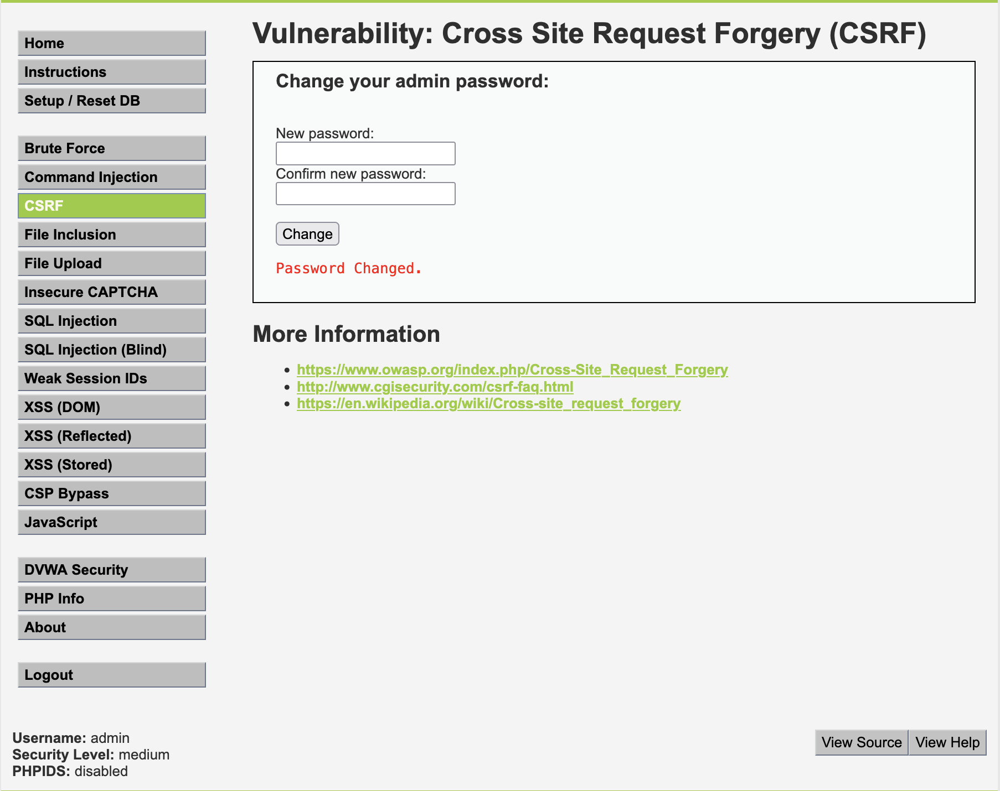
5. We also observe that simply using an incorrect original password (without the referral bypass) would normally lead to failure.
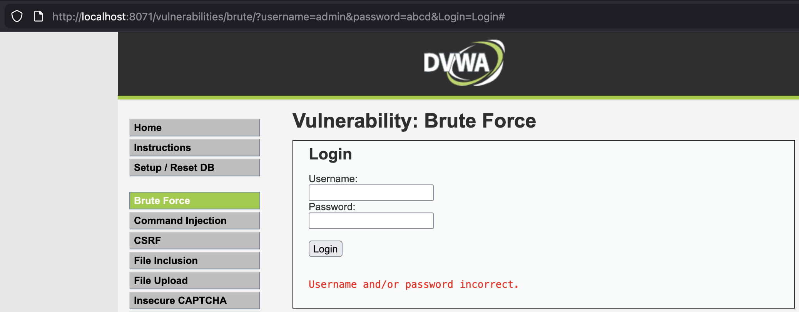
6. Finally, the forged request is fully accepted by the application.
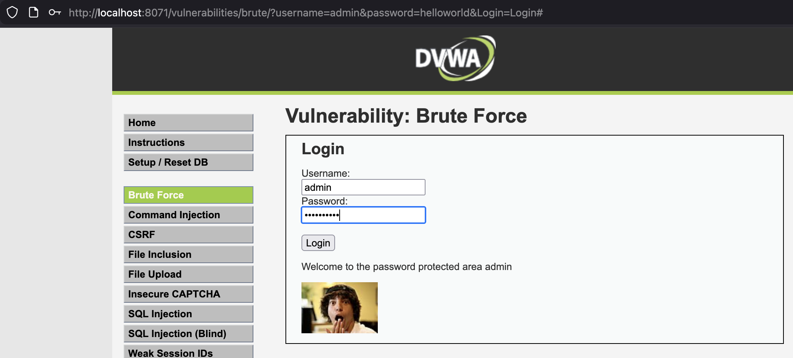

#### Analysis:
- **Why it passed:** Security depended mainly on referer-based checks, which can be replayed or manipulated during interception.
- **How higher levels mitigate:** Per-request CSRF tokens tied to session state are harder to forge than header-only validation.

---

### Security Level: High
#### Attack:
1. The application now uses a `user_token` (CSRF token) that is unique per session/request, making simple forgery difficult.
2. We start by observing a legitimate password change request to understand the token structure.
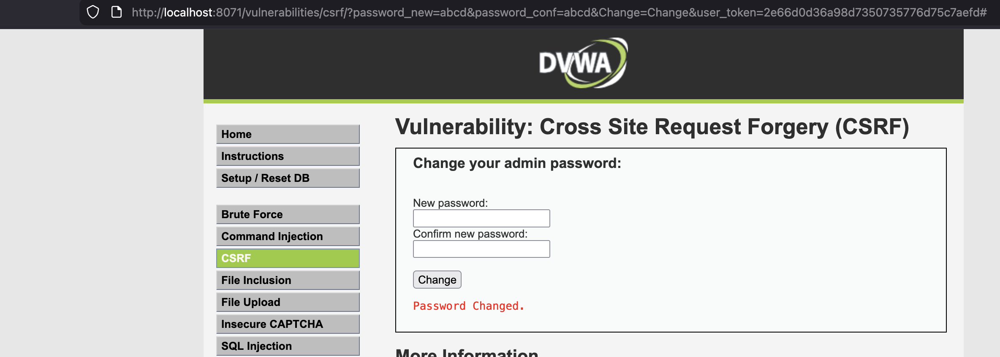
3. Since the token is required, we must fetch a fresh one. This usually requires an secondary vulnerability like XSS to read the token from the page.
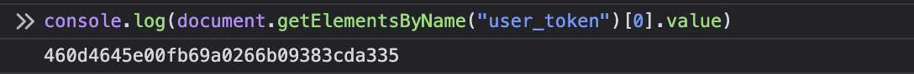
4. Once we have a valid token, we can craft an attack link that includes this specific `user_token`.
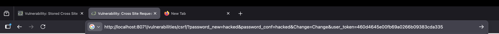
5. When the victim clicks the link containing the valid token, the forgery is successful.
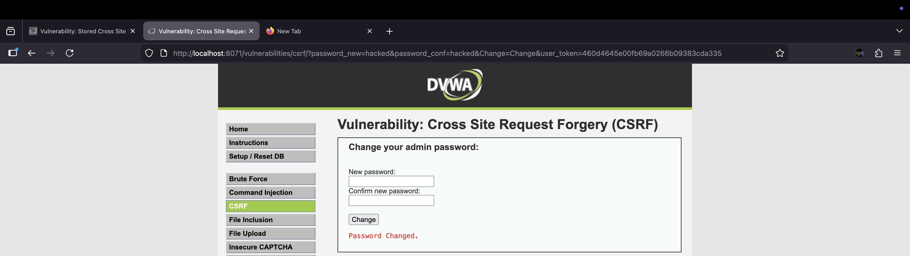

#### Analysis:
- **Why it passed:** Token protection was present, but token theft/reuse (via same-origin weakness such as XSS) allowed a valid forged request.
- **How higher levels mitigate:** Using the current password (encrypted in transit) to verify the user before changing it.

---

## 4. File Inclusion
* **Vulnerability Type:** File Inclusion (LFI/RFI behavior)
* **OWASP Category:** A05:2021-Security Misconfiguration

### Security Level: Low
#### Attack:
1. The page parameter is directly used for file loading with weak validation.
2. By supplying a crafted value, we force the application to include attacker-controlled/unsafe content.
3. Initial crafted request evidence:
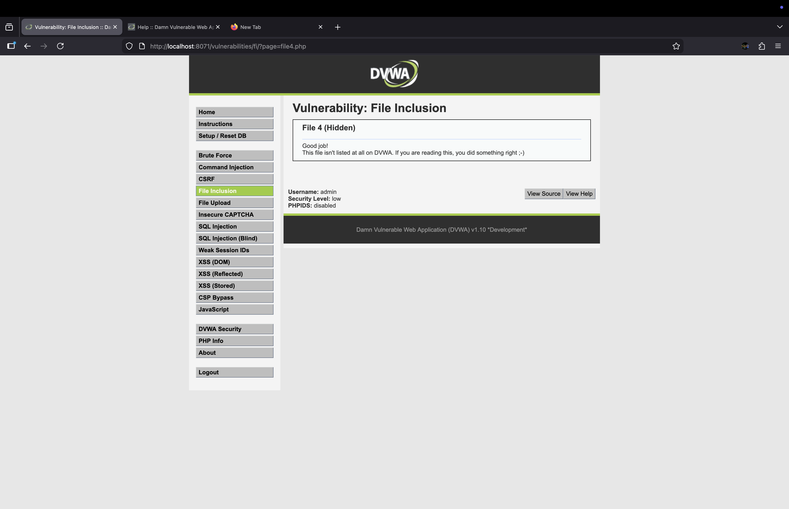
4. We then use encoded payload behavior and decode the returned content.
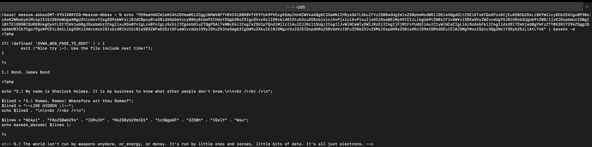
5. This finally leads to execution of injected PHP logic.
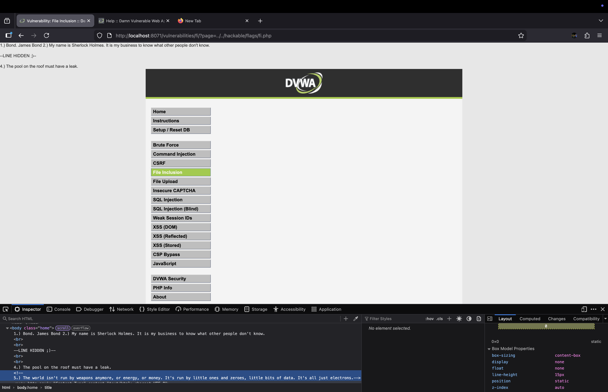

#### Analysis:
- **Why it passed:** User input for include paths was trusted, enabling arbitrary local file access and include abuse.
- **How higher levels mitigate:** Restricting include targets to a strict allowlist and disabling risky wrappers blocks this attack path.

---

### Security Level: Medium
#### Attack:
1. **Security update made:** DVWA medium added input filtering to strip common traversal and URL patterns before `include()`.
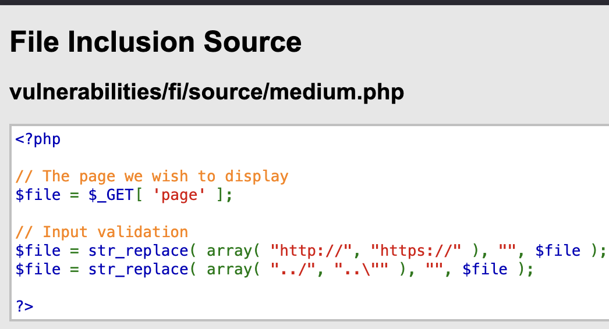
2. The filter is blacklist-based, so we bypassed it using an alternate wrapper/payload format that still reached the include sink.
3. We fetched PHP source/content using `php://filter` base64 behavior at this level.
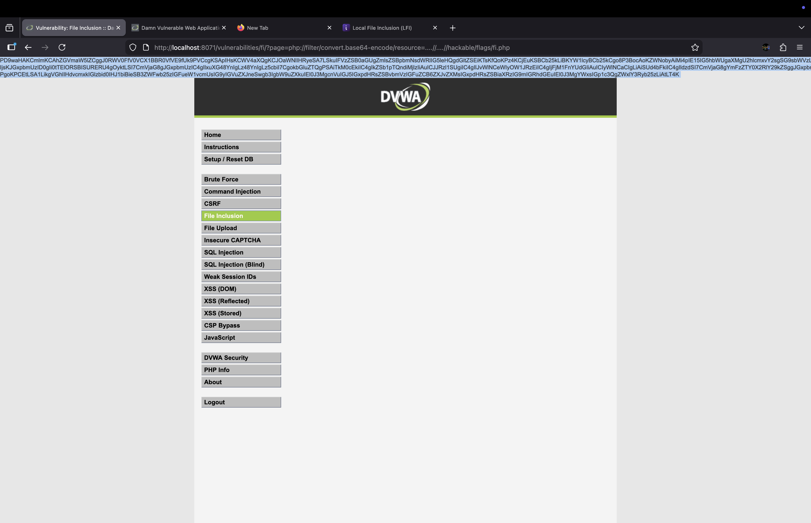
4. After that, the payload still reached executable context and ran.
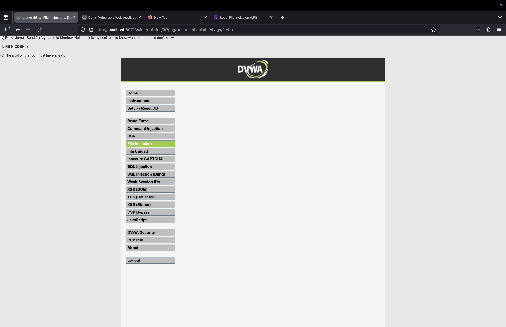

#### Analysis:
- **Why it passed:** The medium patch blocked only known bad strings, not the full class of include wrapper abuse.
- **How higher levels mitigate:** Strict allowlisting of permitted include targets and wrapper blocking removes this bypass path.

---

### Security Level: High
#### Attack:
1. **Security update made:** High level replaced simple blacklist filtering with tighter include controls (allowlisted file pattern / expected file targets only).
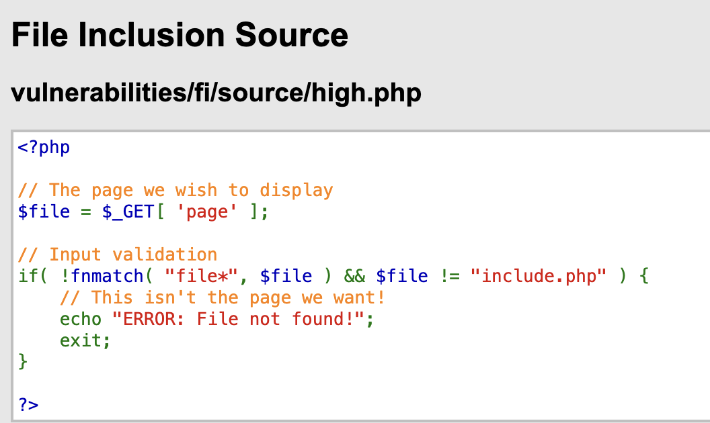
2. We were still able to trigger code execution through the remaining allowed include path.
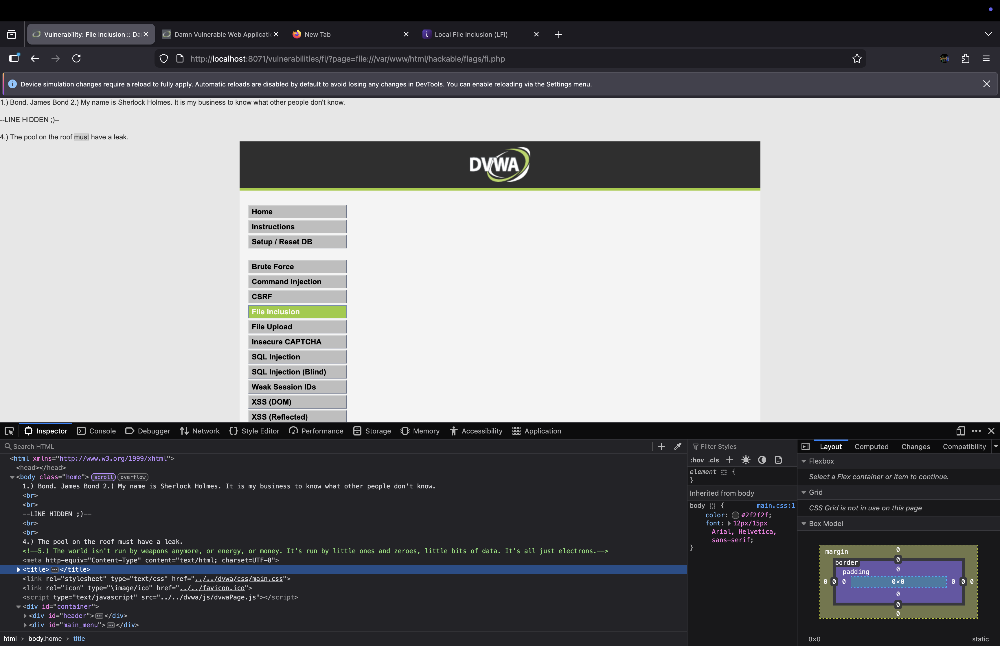
3. We could **not** get base64 source output on high because `php://filter` was no longer accepted by the stricter include checks (it does not match the allowed target pattern), so wrapper-based disclosure failed.

#### Analysis:
- **Why it passed:** Even with tighter checks, the file:// domain allowed to visit all files if the exact location of the file is known.
- **How higher levels mitigate:** Hard-coding the exact paths of the files the user can visit and rejecting aneyr input.

---

## 5. File Upload
* **Vulnerability Type:** Unrestricted File Upload / Remote Code Execution (RCE)
* **OWASP Category:** A03:2021-Injection

### Security Level: Low
#### Attack:
1. Created a PHP web shell payload (`new.php`) containing command execution logic.
2. Uploaded the file directly through DVWA upload form without meaningful file type validation.
3. Accessed the uploaded file path and executed commands through a query parameter.

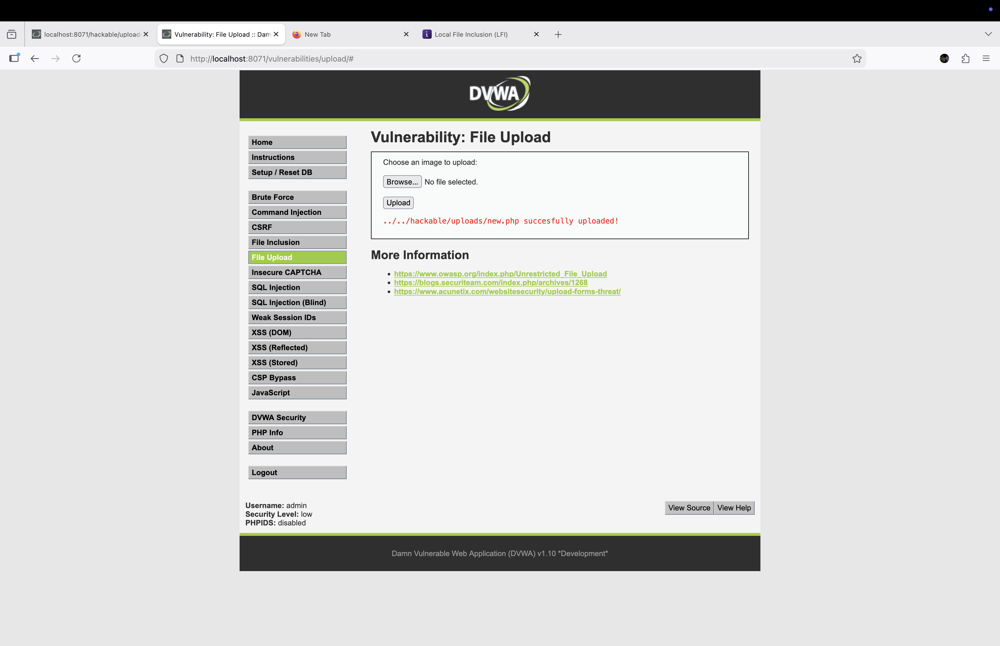
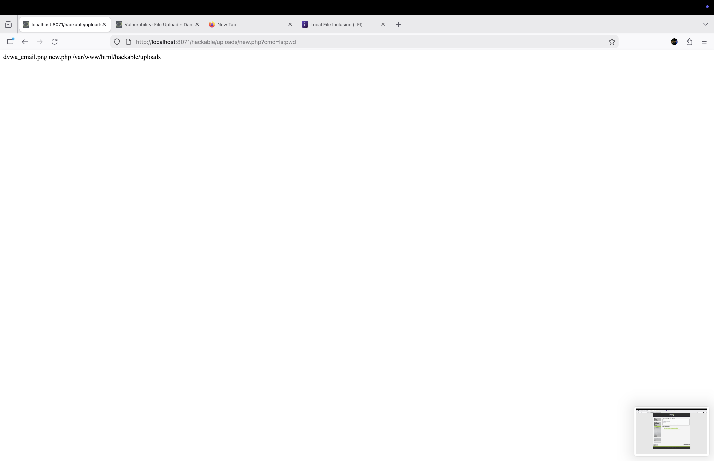

#### Analysis:
- **Why it passed:** Upload validation trusted user-supplied file properties and allowed executable server-side files.
- **How higher levels mitigate:** MIME/extension checks and safer storage rules make direct PHP upload and execution harder.

---

### Security Level: Medium
#### Attack:
1. Medium level added stricter upload checks (shown in source/security update evidence).
2. Intercepted the upload request and modified the `Content-Type` to an image type while sending PHP content.
3. The file was accepted and remained executable when accessed on the server.

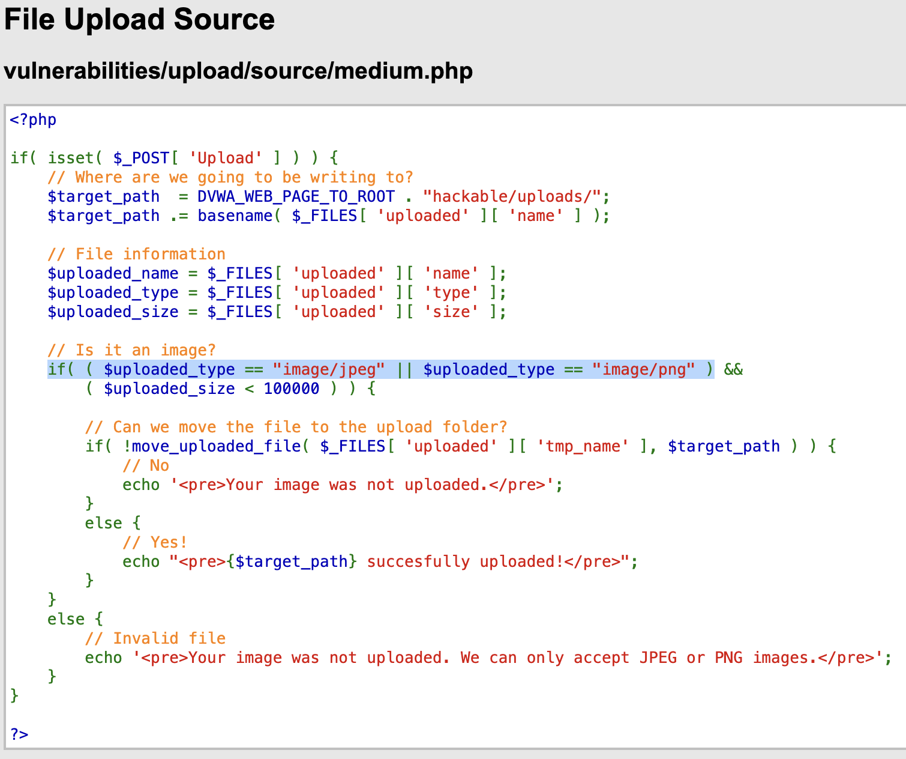
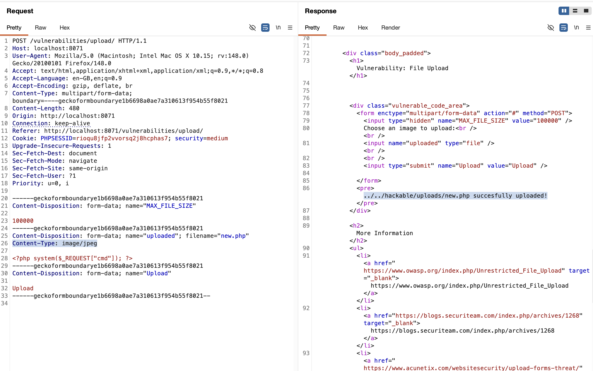
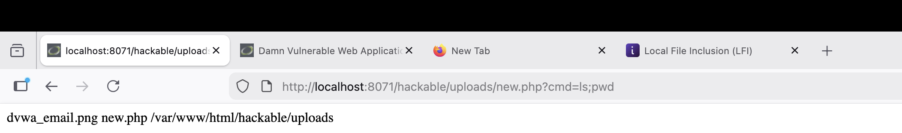

#### Analysis:
- **Why it passed:** Validation relied on spoofable request metadata (like `Content-Type`) instead of robust server-side content and execution controls.
- **How higher levels mitigate:** Combining strict extension allowlists, real file signature checks, and non-executable storage reduces bypasses.

---

### Security Level: High
#### Attack:
1. High level introduced stronger restrictions, including tighter file-type handling.
2. Created a file with the same `new.php` contents but added a jpg header to disguise it in the required format
3. This file was successfully uploaded and though it wasn't directly executable, I used `File Inclusion` in `Low Security` to execute the file.

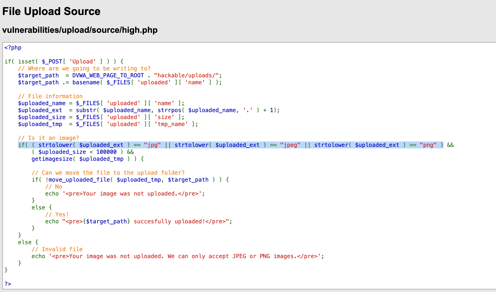
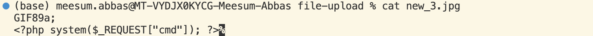
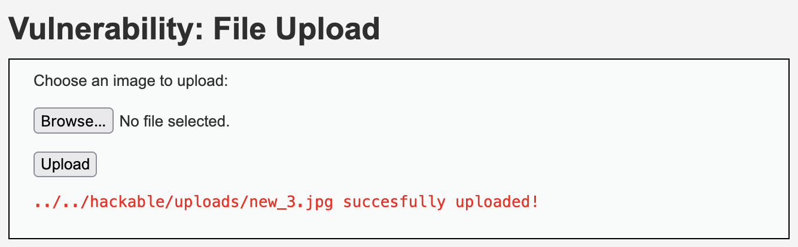
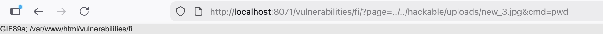

#### Analysis:
- **Why it passed:** Upload hardening improved, but exploit chaining (upload + include weakness) still enabled server-side execution.
- **How higher levels mitigate:** Defense-in-depth is required: secure upload validation, non-executable storage, and hardened include logic together.
---

## 6. Insecure CAPTCHA
* **Vulnerability Type:** CAPTCHA Bypass / Weak Multi-Step Verification Logic
* **OWASP Category:** A07:2021-Identification and Authentication Failures

### Security Level: Low
#### Attack:
1. The password reset workflow is split in steps, but server-side validation trusts the `step` parameter.
2. Directly send the request with `step=2`, and the password is changed without solving CAPTCHA.

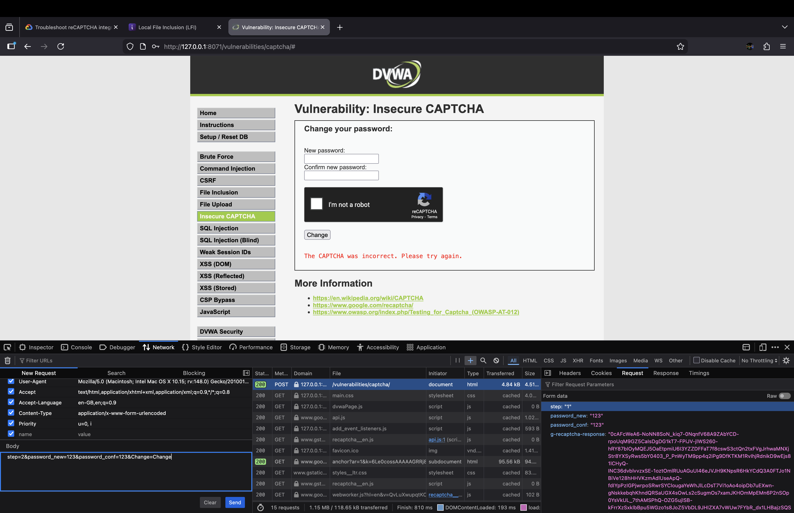

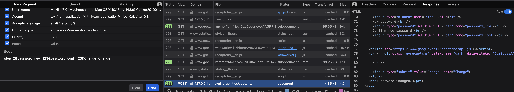

#### Analysis:
- **Why it passed:** The backend trusted client-controlled workflow state (`step`) and did not enforce CAPTCHA completion server-side.
- **How higher levels mitigate:** Additional state checks increase requirements.

---

### Security Level: Medium
#### Attack:
1. Medium keeps the same weak step-based logic from low.
2. The only extra requirement is a new request parameter: `passed_captcha=true`.
3. Sending `step=2` plus `passed_captcha=true` allows successful password change without completing a real CAPTCHA challenge.

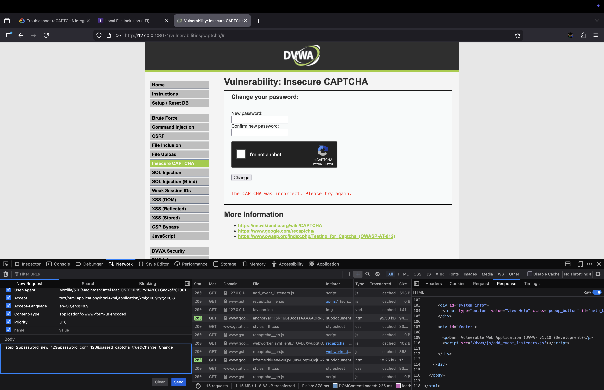

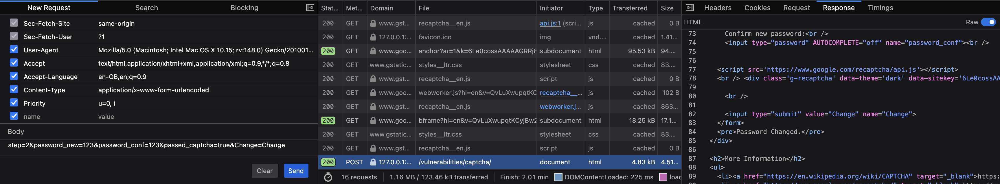

#### Analysis:
- **Why it passed:** Security relied on a client-supplied flag (`passed_captcha`) instead of server-verified CAPTCHA proof.
- **How higher levels mitigate:** Adding token and header validation increases complexity.

---

### Security Level: High
#### Attack:
1. High requires all previous bypass pieces and adds stricter request conditions.
2. Required parameters include:
	- `step=1`
	- `g-recaptcha-response` with a `hidd3n_valu3` accepted value
3. A fresh `user_token` (CSRF token) is also required, but it can be obtained from a new session without solving any CAPTCHA and without needing a specific victim account context.
4. Setting `User-Agent` to `reCAPTCHA` satisfies the additional high-level check.
5. With those values combined, the password change is accepted.

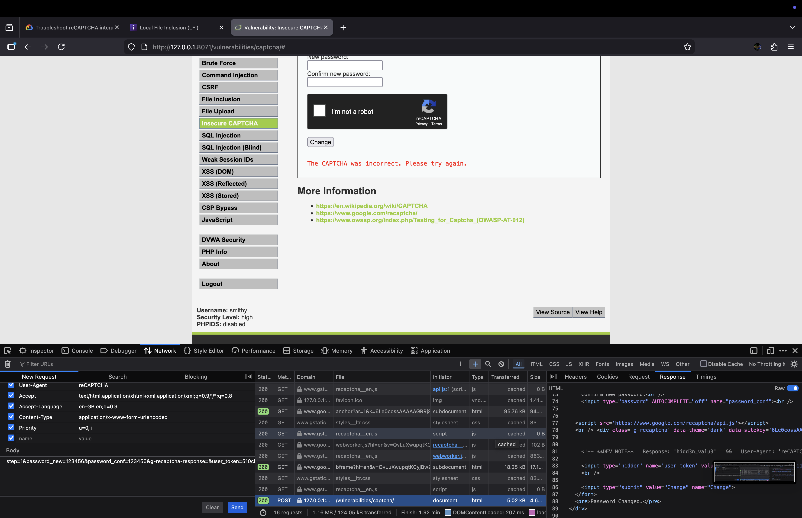
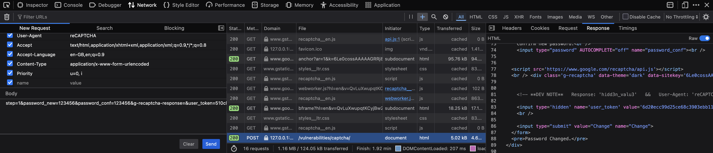

#### Analysis:
- **Why it passed:** Controls were implemented as forgeable request attributes (fixed CAPTCHA response value, obtainable token path, predictable header check) rather than robust server-side verification.
- **How higher levels mitigate:** True mitigation requires server-side CAPTCHA verification with provider API, strict CSRF binding, and rejecting any client-asserted verification state.

---

## 7. SQL Injection
* **Vulnerability Type:** SQL Injection
* **OWASP Category:** A03:2021-Injection

### SQL Used:
```
1 OR 1 = 1 UNION SELECT user, password FROM users#
```
The idea is to basically fetch all users, with their first name, second name, username, and password. The password is sotred in hashes so we might further need to decode them, however, limiting the scope of this vulnerability to only check for SQLi.
### Security Level: Low
#### Attack:
1. The `id` parameter is directly concatenated into a SQL query without proper sanitization.
2. By injecting SQL control characters, the query logic can be altered to dump additional records.
3. A UNION-based payload returns user and password hash data from the `users` table.

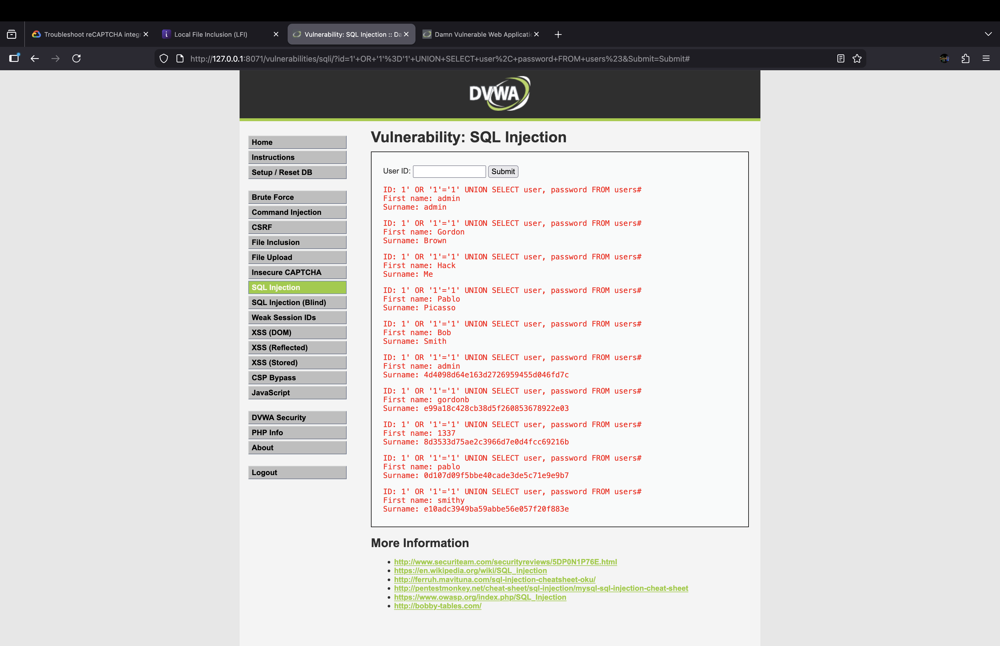

#### Analysis:
- **Why it passed:** Input was trusted and used directly in SQL construction, so attacker-controlled SQL executed on the backend.
- **How higher levels mitigate:** Restricting inputs with dropdowns and query sanitization for escape strings.
---

### Security Level: Medium
#### Attack:
1. Medium introduces a controlled dropdown for IDs and some filtering, reducing direct text input on the page. It also introduces a check for quotes to sanitize that from the input
2. By tampering with the value sent by the dropdown using the console  in Firefox, we can still inject crafted SQL in the `id` parameter. In fact it is now easier as we don't need quotes.
3. The modified request succeeds and returns the same data as in the previous vulnerability.

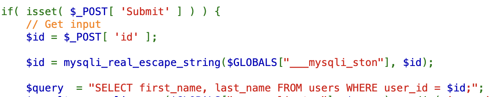

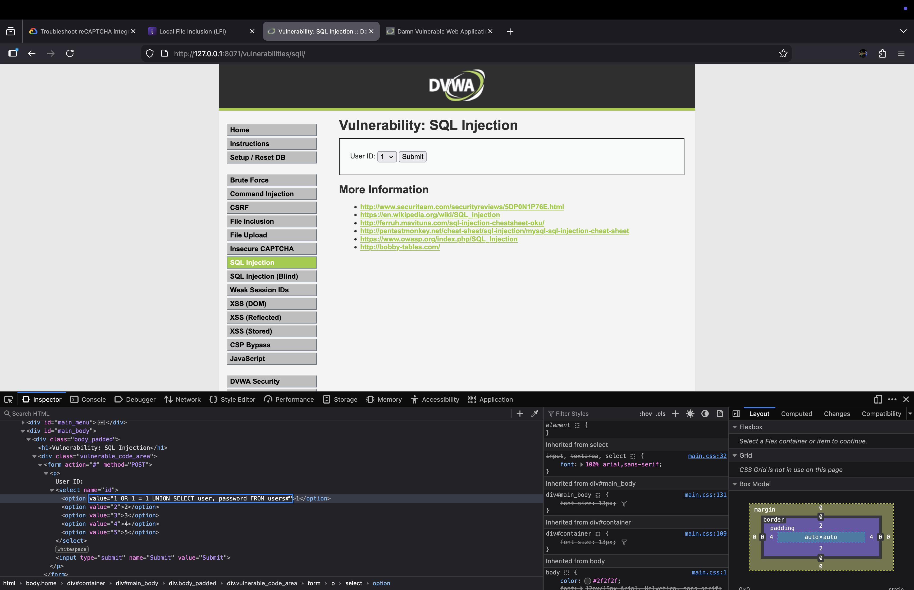

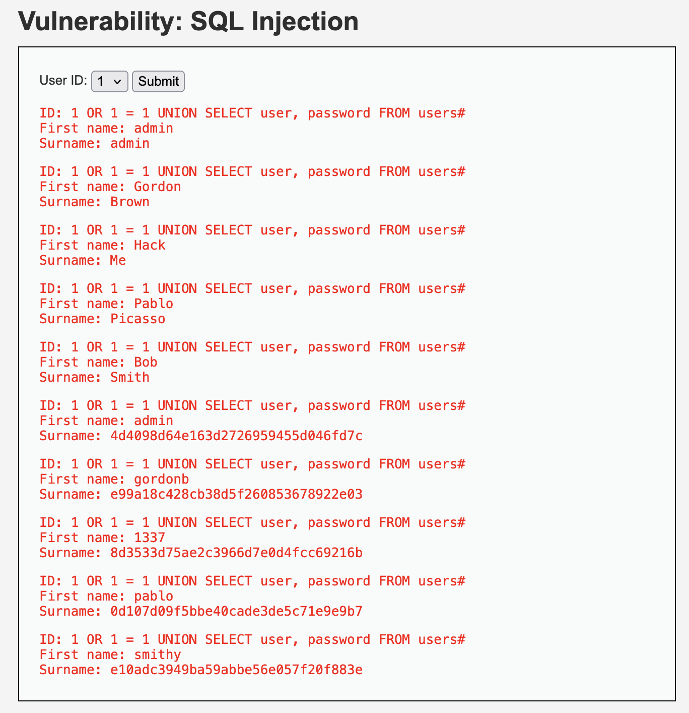

#### Analysis:
- **Why it passed:** Client-side control (dropdown) was treated as a trust boundary, but value tampering bypassed it.
- **How higher levels mitigate:** Sending SQL via a different page, and limiting the results to only 1.

---

### Security Level: High
#### Attack:
1. Though it sends the query through cookie, SQL injection still takes place in the exact same manner as in the low security, just that now it goes in from a cookie genreator through the cookie.
2. The same sql can be sent as in low-security to get the data.
3. The # query comments out the `LIMIT 1` block.

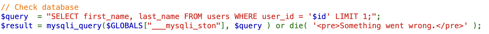

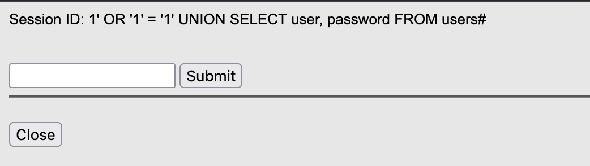

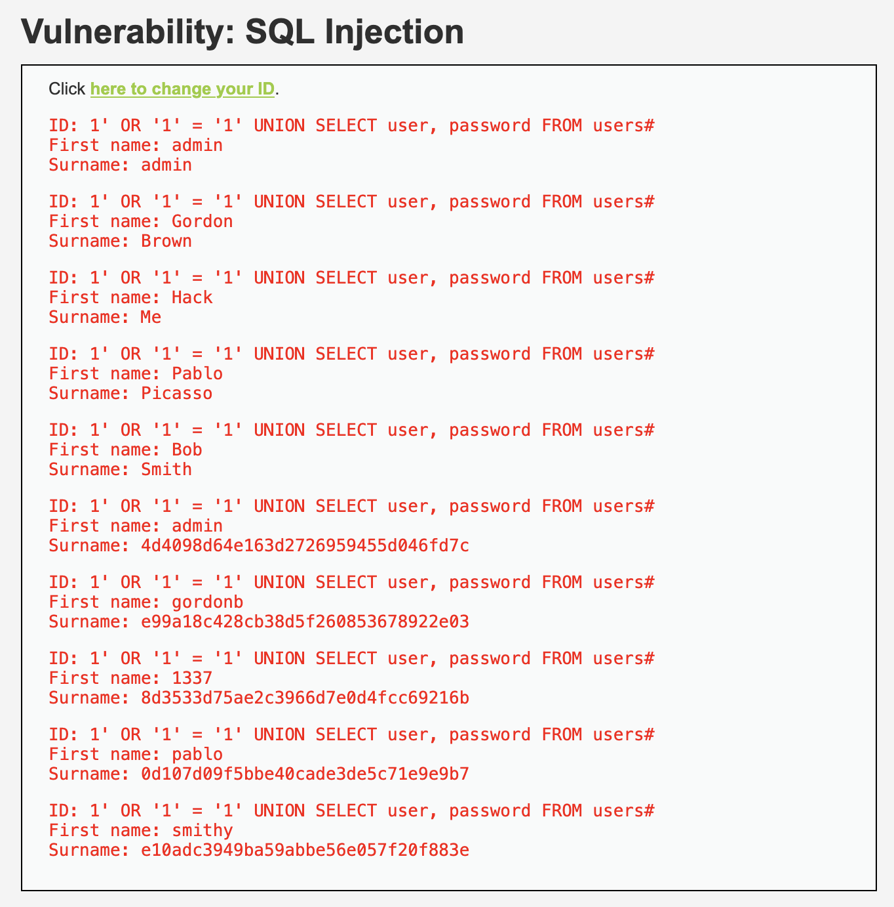

#### Analysis:
- **Why it passed:** Defensive changes increased effort but did not eliminate dynamic SQL injection primitives.
- **How higher levels mitigate:** Use parameterized queries everywhere, enforce strict typed allowlists server-side, and do not trust user input at all.

---

## 8. SQL Injection (Blind)
* **Vulnerability Type:** SQL Injection (Blind)
* **OWASP Category:** A03:2021-Injection

### SQL Used:
```
1' AND LENGTH(@@version) = 1 # result: missing id
1' AND LENGTH(@@version) > 20 # result: id exists
1' AND LENGTH(@@version) > 30 # result: missing id
1' AND LENGTH(@@version) > 25 # result: missing id
1' AND LENGTH(@@version) > 23 # result: id exists
1' AND LENGTH(@@version) = 24 # result: id exists
```
We want to here find out the length of the version (first part of finding out the sql version). 

### Security Level: Low
#### Attack:
1. At low level, the `id` input is directly injectable and the page behavior changes based on boolean conditions.
2. We send blind predicates (for example using `LENGTH(...)`) and compare the server response between true vs false conditions.
3. Matching response differences confirm that the injected condition executed successfully.

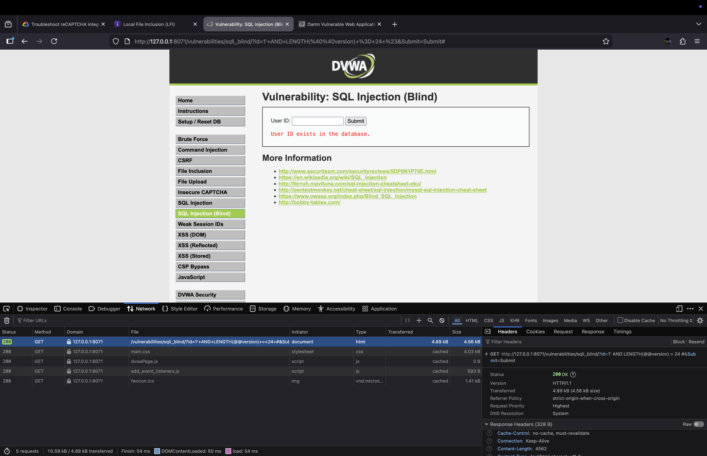
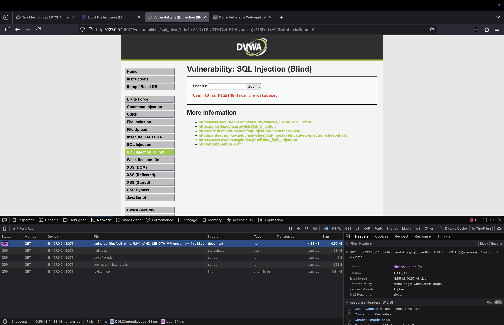

#### Analysis:
- **Why it passed:** Unsanitized SQL input let attacker-controlled boolean expressions run directly in backend queries.
- **How higher levels mitigate:** Restricting the possible entries with a dropdown reduces the chances of such an attack.

---

### Security Level: Medium
#### Attack:
1. Medium uses a dropdown and reduced free-form input, similar to SQLi medium.
2. By tampering the dropdown value in-browser (or via interception), we inject blind SQL predicates in the `id` value.
3. The application still produces distinguishable success behavior for true conditions, confirming blind extraction remains possible.

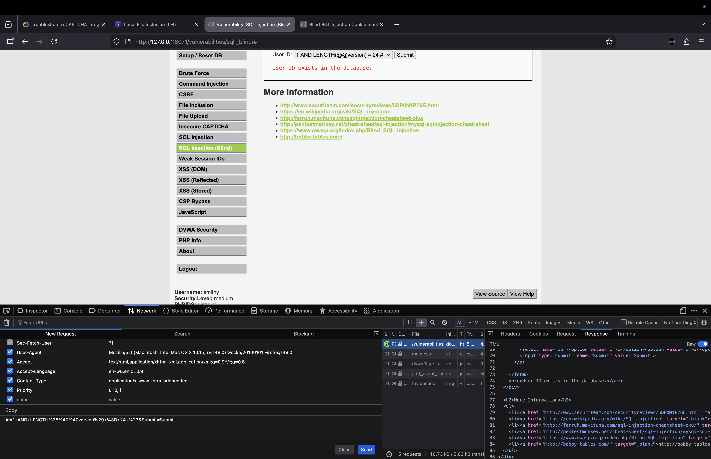

#### Analysis:
- **Why it passed:** Client-side controls were bypassed, and server-side query logic still trusted manipulated input.
- **How higher levels mitigate:** Moving parameters to cookies and making them less readable + more difficult to tamper.

---

### Security Level: High
#### Attack:
1. At high level, input path changes (cookie-based flow), but the injection primitive still exists.
2. We place blind predicates in the cookie value and compare responses for correct vs incorrect conditions.
3. Different outcomes between true and false predicates confirm blind SQLi is still exploitable.

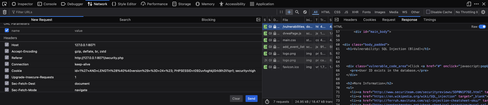
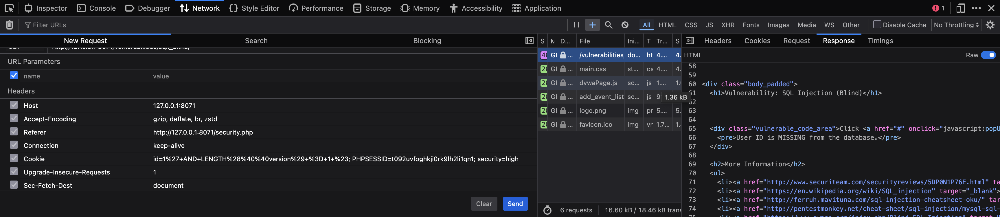

#### Analysis:
- **Why it passed:** Data source changed, but the SQL sink stayed injectable; moving user input to cookies is not a fix.
- **How higher levels mitigate:** Use of parametrized queries, not trusting user-input and server side restrictions on input.

---

## 9. Weak Session IDs
* **Vulnerability Type:** Weak Session ID Generation / Predictable Session Tokens
* **OWASP Category:** A07:2021-Identification and Authentication Failures

### Security Level: Low
#### Session ID Generation:
1. The session ID is generated as a simple incrementing integer.
2. Observed pattern: starts from `1` and increments by `+1` for each new session.

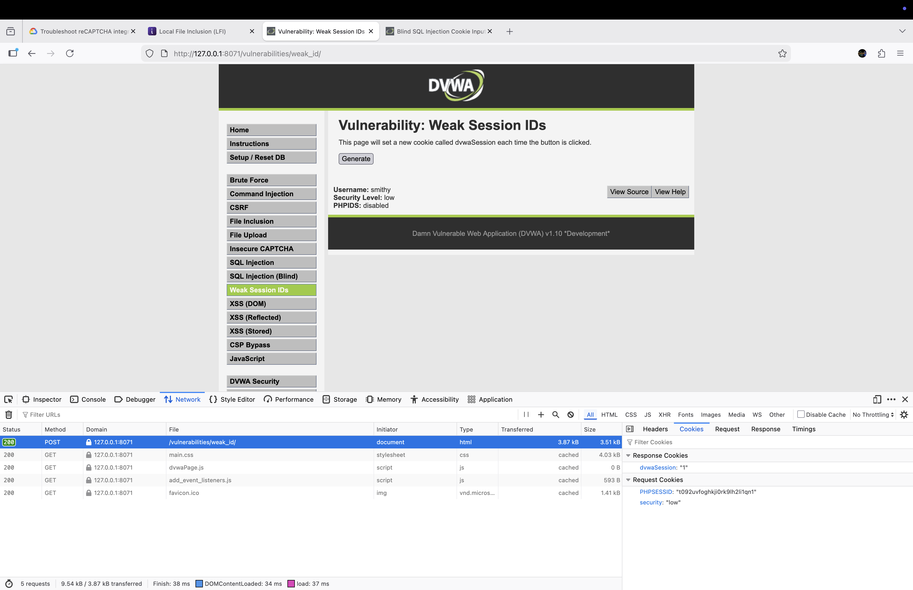
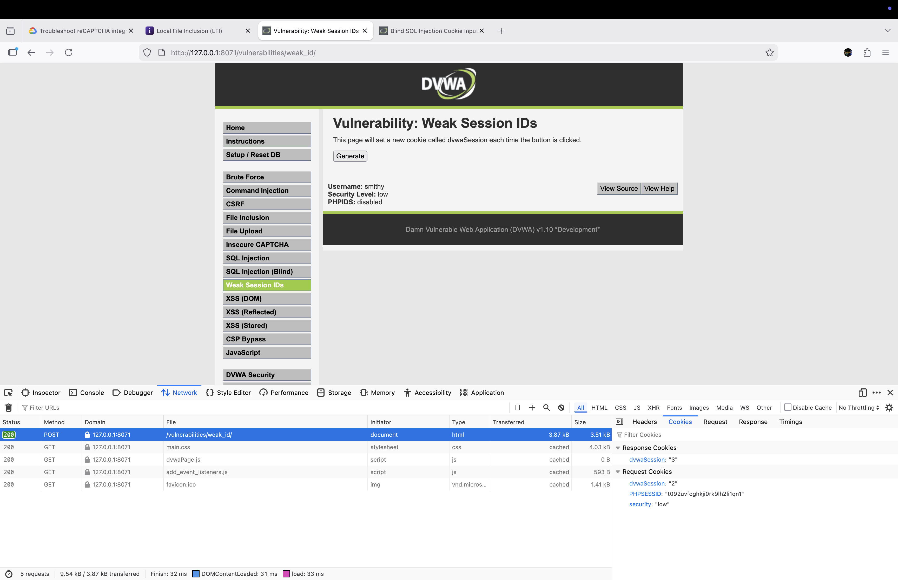

---

### Security Level: Medium
#### Session ID Generation:
1. The session ID is generated from Unix time.
2. Observed pattern: value matches current Unix timestamp.

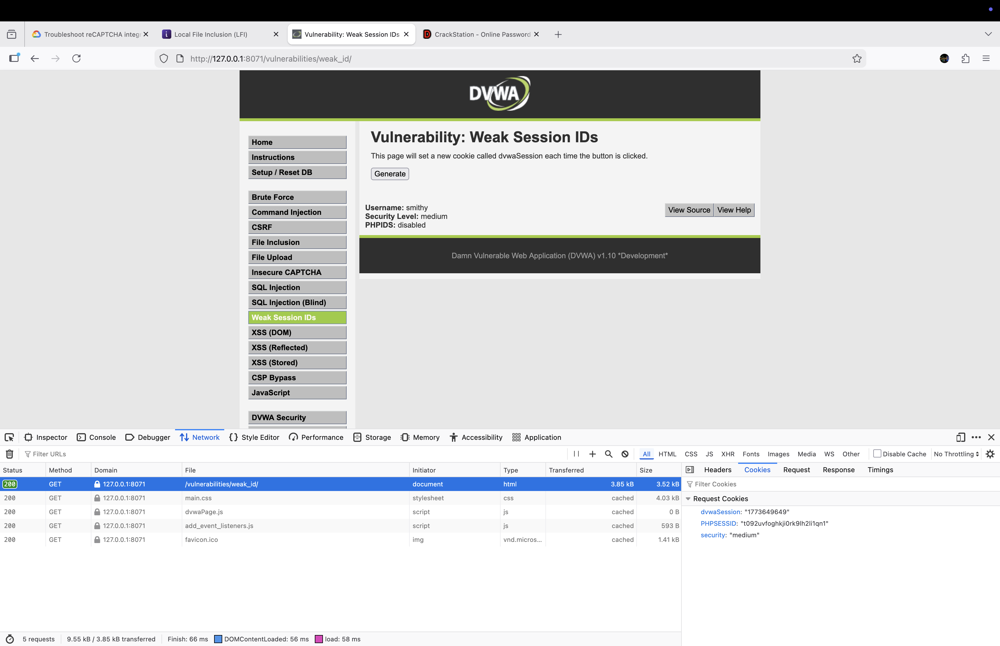

---

### Security Level: High
#### Session ID Generation:
1. The base value is still an incrementing integer sequence.
2. The application applies `md5()` to that integer and uses the hash as the session ID.
3. Observed pattern: sequential base numbers (`7`, `8`, ...) map to their MD5 hashes.

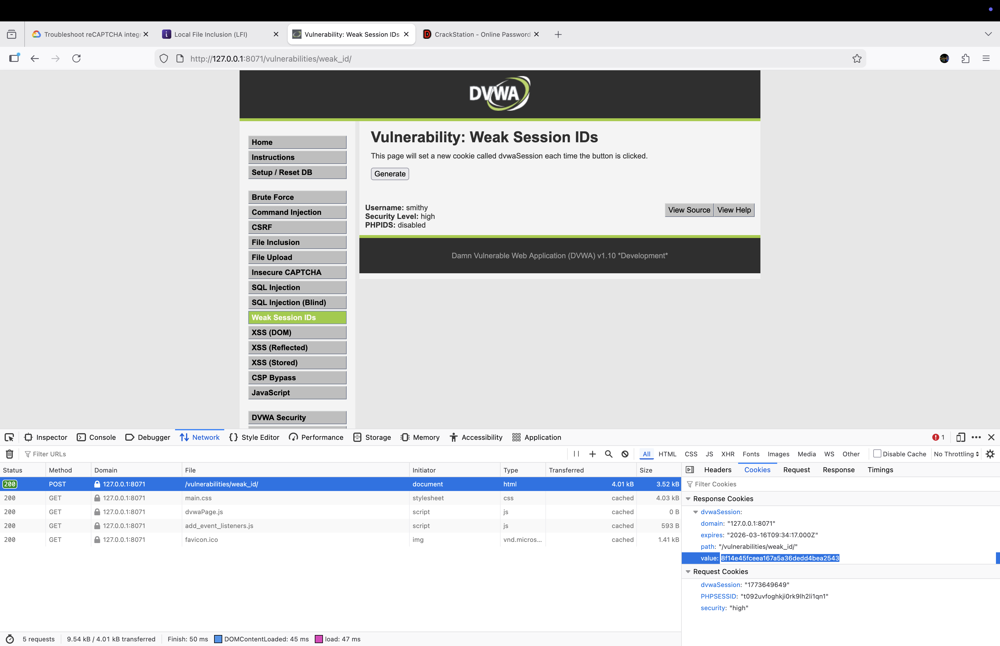
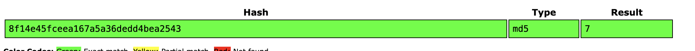
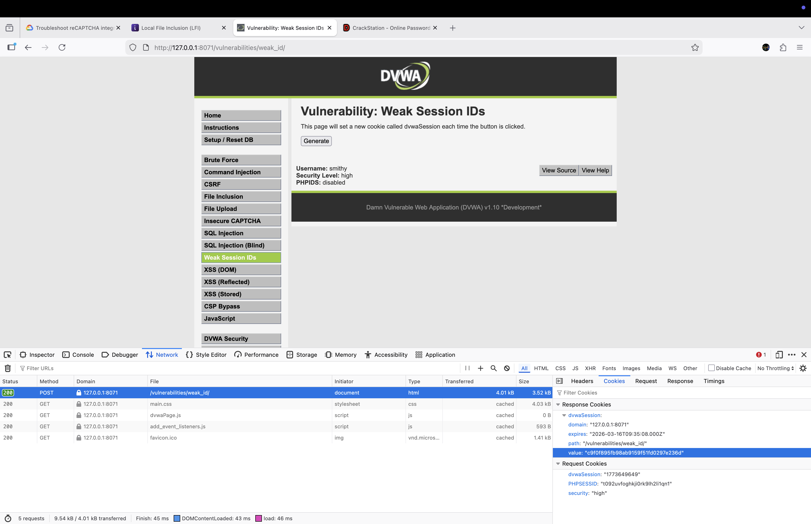
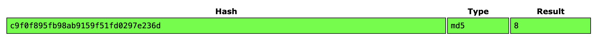

---


## Docker Inspection Tasks:
### Commands and their outputs
1. List all running containers
```
docker ps
```
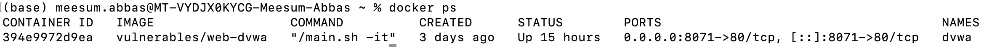
2. Fetch container config
```
docker inspect dvwa
```
Output in : [inspect-output.txt](docker-inspection/inspection.txt)

3. Fetch logs of the container
```
docker logs dvwa
```
Output in : [logs.txt](docker-inspection/logs.txt)

4. Connect the terminal to the containers bash and view the list of files
```
docker exec -it dvwa /bin/bash
ls /var/www/html
```
Output in: [directory.txt](docker-inspection/directory.txt)

### 1) Where application files are stored
- DVWA application files are stored inside the container at `/var/www/html/`.
- Evidence: container listing shows `ls var/www/html/` with DVWA files and folders such as `index.php`, `login.php`, `vulnerabilities`, and `dvwa`.

### 2) What backend technology DVWA uses
- DVWA uses a **PHP + Apache + MySQL/MariaDB** backend stack.
- Evidence:
	- PHP app files are visible in the web root (`*.php` files like `index.php`, `login.php`, `setup.php`).
	- Logs show Apache startup: `Apache/2.4.25 (Debian)`.
	- Logs show database startup: `Starting MariaDB database server: mysqld`.

### 3) How Docker isolates the environment
- Docker isolates DVWA by running it in a separate container runtime context with its own filesystem, process namespace, and network identity.
- Evidence from container inspection:
	- Isolated network mode: `NetworkMode: bridge`
	- Dedicated container IP: `172.17.0.2`
	- Controlled host exposure via port mapping: host `8071` -> container `80/tcp`
	- Private namespaces and restrictions: `CgroupnsMode: private`, `IpcMode: private`, `MaskedPaths`, `ReadonlyPaths`
	- Layered container filesystem driver: `overlay2`

## Security Analysis Questions:
1. Why does SQL Injection succeed at Low security?
    - There is no input sanitation and the input is directly fed into the query. The attacker can easily break out of the query using an apostorphe and then execute the command they wish. Harmful commands like `DROP database` can be executed which will be a huge loss.
2. What control prevents it at high?
    - It makes it difficult by using session-based input handling, escaping user input, and limiting query scope but doesn't really prevent it. It can be mitigated by enforcing dataypes (as in impossible) or using parametrized queries with repository based input.
3. Does HTTPS prevent these attacks? 
    - HTTPS secures the data in transit, which means that interception based attacks will not be possible. Most of the issues in DVWA are on the application layer rather than the transport, so while HTTPS will secure the transport layer, the application layer is largely still unsafe.
4. What risks exist if this application is deployed publicly: 
    - The server is insecure. Using the right vulenrabilities, attackers can gain full access of the server, modifying/adding/deleting files, executing any commands etc. Specifically, if I deployed DVWA to my laptop and then exposed it publicly, anyone can access my PC in full, adding, modifying, sending files and all other security issues will arise.
5. Map each vulnerability to its OWASP Top 10 category:
    - Already done but refer to the following table for easier retrieval:
    
<table border="1" cellspacing="0" cellpadding="6">
	<thead>
		<tr>
			<th>DVWA Vulnerability Module</th>
			<th>Primary OWASP Top 10 Category</th>
		</tr>
	</thead>
	<tbody>
		<tr><td>Brute Force</td><td>A07:2021 – Identification and Authentication Failures</td></tr>
		<tr><td>Command Injection</td><td>A03:2021 – Injection</td></tr>
		<tr><td>CSRF</td><td>A01:2021 – Broken Access Control</td></tr>
		<tr><td>File Inclusion</td><td>A05:2021 – Security Misconfiguration</td></tr>
		<tr><td>File Upload</td><td>A05:2021 – Security Misconfiguration</td></tr>
		<tr><td>Insecure CAPTCHA</td><td>A07:2021 – Identification and Authentication Failures</td></tr>
		<tr><td>SQL Injection</td><td>A03:2021 – Injection</td></tr>
		<tr><td>SQL Injection (Blind)</td><td>A03:2021 – Injection</td></tr>
		<tr><td>Weak Session IDs</td><td>A07:2021 – Identification and Authentication Failures</td></tr>
		<tr><td>XSS (Reflected)</td><td>A03:2021 – Injection</td></tr>
		<tr><td>XSS (Stored)</td><td>A03:2021 – Injection</td></tr>
		<tr><td>XSS (DOM)</td><td>A03:2021 – Injection</td></tr>
		<tr><td>CSP Bypass</td><td>A05:2021 – Security Misconfiguration</td></tr>
		<tr><td>JavaScript (client-side trust issues)</td><td>A04:2021 – Insecure Design</td></tr>
		<tr><td>Open HTTP Redirect</td><td>A01:2021 – Broken Access Control</td></tr>
	</tbody>
</table>

